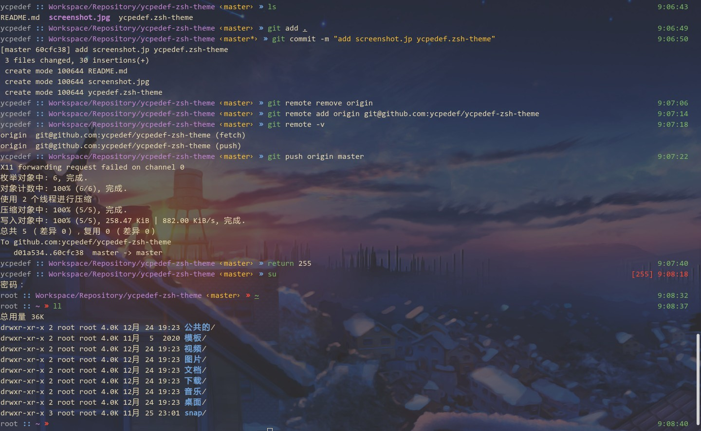

# ycpedef-zsh-theme  
A theme for zsh, used by ycpedef.

## auto install:  

```bash
wget https://raw.githubusercontent.com/ycpedef/ycpedef-zsh-theme/master/ycpedef.zsh-theme -O $ZSH/custom/themes/ycpedef.zsh-theme)"
omz theme use ycpedef
```

## manually:  
just copy ycpedef.zsh-theme to your zsh custom theme folder

## screenshot  


